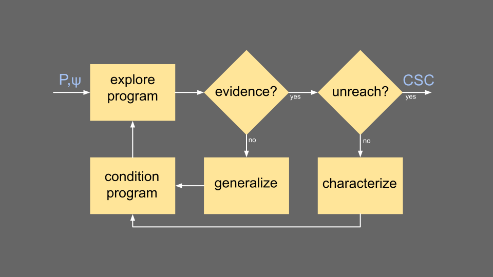

---
title: ALPACA documentation
...

These pages document the implementation of ALPACA.
We'll see [what ALPACA computes],
discuss [how it computes this][Alternating Conditional Analysis],
and [step through a typical run][Stepping through a run]
to name some code modules as they are used.
An [index][Index to source files] to more complete
documentation of individual source files is given at the end.

What ALPACA computes
--------------------

ALPACA is an analysis tool that determines, for some program
and some property-to-be-checked, all the program paths that
*must* or *may* satisfy the property.
(*Must* information guarantees reachability; *may* information
overapproximates and could introduce false positives.)
These program paths are expressed as logical formulae
constraining the values of program inputs.
For example, consider trying to determine the constraints
on `x` and `y` that lead to reaching an `error()` call
in the following C program.

``` c
main() {
  int x=input(); int y=input();

  if (x<0) {
    error();
  } else if ((x>9) && (x<y*y)) {
    error();
  }
}
```

We see that an `error()` can be reached in two ways:
if $x<0$, or if $x>9 \land x<y*y$; and all inputs that
do not satisfy these constraints will avoid any `error()`.
ALPACA runs a host of tools that look for reachability
or unreachability proofs.
If the underlying tools can determine the two reachability
constraints described above as well as provide an unreachability
proof in the remainder of the program (i.e., inputs not
satisfying the two constraints), then ALPACA will return
this exact description.

However, determining that all inputs outside of these
constraints do not lead to an `error()` may be
difficult for an automated static analysis due to the
nonlinear constraint $x<y*y$.
In this case, we may try relaxing the constraint of
$x>9 \land x<y*y$ to be simply $x>9$.
With the nonlinearity removed, the static analyses
can prove that inputs outside of $x<0 \lor x>9$ will
not lead to an `error()`, and the description of
program paths returned by ALPACA becomes slightly
more approximate: an `error()` *must* be reached if
$x<0$, or if $x>9 \land x<y*y$, and *may* be reached
if $x>9$; everything not implied by these formulae
will avoid the `error()`.

This mix of *must* and *may* characterizations is
computed using the alternating conditional analysis
framework, described next.

Alternating Conditional Analysis
--------------------------------

ALPACA is an instantiation of the Alternating Conditional
Analysis (ACA) framework.
ACA builds upon ideas from
conditional model checking [@beyer:2012:conditional]
and alternation between *may* and *must* pieces of
information returned by an
analysis [@godefroid:2010:compositional].

ACA takes as input a program and a property,
and returns a logical characterization that
relates the property’s reachability to all program states.
We call this structure a comprehensive state characterization, 
or a CSC.
ACA iteratively collects this logical description by
running multiple analysis tools to explore the program
in parallel,
characterizing their results,
and blocking (i.e., conditioning away from)
already-seen paths until 
all of the paths have been accounted for.
In order to reach a fixed point, if no new evidence
is found, there is a generalization phase that
"widens" the CSC, i.e., relaxes some *must* constraints
to *may* constraints.
The terminating condition is when some overapproximating
tool reports unreachability in the thus-uncovered
portion of the program.
The flow diagram for ACA is given below.



The above flow diagram is directly reflected in its
implementation within ALPACA.
Below is the recursive `aca` function within
`Analysis.lhs`.
(The assumed property is to check for the
reachability of a `__VERIFIER_error()` call.)

``` haskell
aca :: Program -> Csc -> AcaComputation Csc
aca program csc = do
  result <- exploreSubspace program csc
  case result of
    UnreachableEvidence -> do
      csc' <- enforceDisjointness csc
      lastWrites csc'
      return csc'
    (ReachableEvidence ev) -> do
      csc' <- characterize ev
      program' <- condition program csc'
      aca program' csc'
    NoEvidence -> do
      csc' <- generalize csc
      program' <- condition program csc'
      aca program' csc'
```

Stepping through a run
----------------------

To get a rough feel of how the code is executed during
a typical run of ALPACA, let's step through a simulated
run at a high level.

When running `alpaca --portfolio cpaSeq,cbmc foo.c` on
the following simple C program:
``` c
int main() {
  int x=input();
  if (x<0) { error(); }
}
```
1. the command-line arguments are parsed in [Main](app/Main.html)
2. the options are placed in a data structure defined in [Configuration](src/Configuration.html)
3. this configuration is used to instantiate the state of ACA's computation
(defined as a state transformer in [AcaComputation](src/AcaComputation.html))
4. an artifacts folder is created at `./logs_alpaca/foo/`; this is where
conditioned programs, tool results, and logs about each iteration will be
written to
5. the setup steps are done in `runAca` within [Analysis](src/Analysis.html), and the
core logic can now be launched from `aca` within the same file
6. the portfolio of two tools is launched from the function
`exploreSubspace` within [Analysis](src/Analysis.html), which uses functions
defined in [RunPortfolio](src/RunPortfolio.html) and [LaunchBenchexec](src/LaunchBenchexec.html).
7. let's say CBMC finds reachability evidence: $x<0$; this
evidence is verified and characterized as a logical formula via the
symbolic execution engine CIVL, using code from
[RunPortfolio](src/RunPortfolio.html),
[CivlParsing](src/CivlParsing.html),
and [Characterize](src/Characterize.html)
8. this evidence is added to the comprehensive state
characterization (`Csc`) defined in [CscTypes](src/CscTypes.html)
9. `foo.c` is instrumented to block the input space accounted
for in the CSC by adding `assume(!(x<0));` using code from
[Transformations](src/Transformations.html) and [Transformer](src/Transformer.html)
10. the tool portfolio is run on this conditioned program
in a second call to `aca`; this time CPA-Seq declares that
the remainder of the program cannot reach the `error()`
statement, which is ACA's termination condition
11. the final CSC is displayed, the final artifacts are written,
and ALPACA exits

Note that this step-through is not at all exhaustive:
it does not cover the case when
ACA requires generalization (which invokes code within
[Characterize](src/Characterize.html) and
[BinarySearch](src/BinarySearch.html)), does not discuss
all configuration options (shown with `alpaca -h`),
does not list each created artifact, does not
name each code module used, etc.
For more details, refer to the documentation
in the individual source files, linked below.

Index to source files
---------------------

The entrypoint of the program is [Main](app/Main.html),
the high-level logic is in [Analysis](src/Analysis.html), and
the rest is here:

* [AcaComputation](src/AcaComputation.html)
* [BinarySearch](src/BinarySearch.html)
* [Branch](src/Branch.html)
* [Characterize](src/Characterize.html)
* [CivlParsing](src/CivlParsing.html)
* [Configuration](src/Configuration.html)
* [CpaParsing](src/CpaParsing.html)
* [CscTypes](src/CscTypes.html)
* [LaunchBenchexec](src/LaunchBenchexec.html)
* [Lib](src/Lib.html)
* [LocalPaths](src/LocalPaths.html)
* [ModularAca](src/ModularAca.html)
* [Octagon](src/Octagon.html)
* [Parsing](src/Parsing.html)
* [Portfolio](src/Portfolio.html)
* [Reading](src/Reading.html)
* [Refine](src/Refine.html)
* [RunPortfolio](src/RunPortfolio.html)
* [Solver](src/Solver.html)
* [SolverLib](src/SolverLib.html)
* [Statistics](src/Statistics.html)
* [Transformations](src/Transformations.html)
* [Transformer](src/Transformer.html)
* [Writing](src/Writing.html)

# References